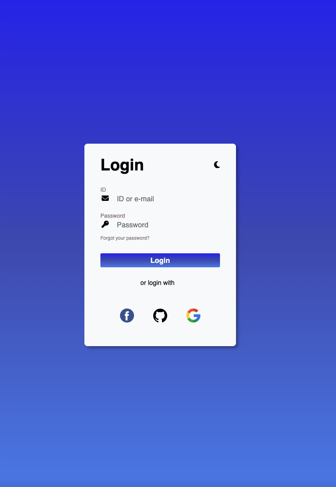
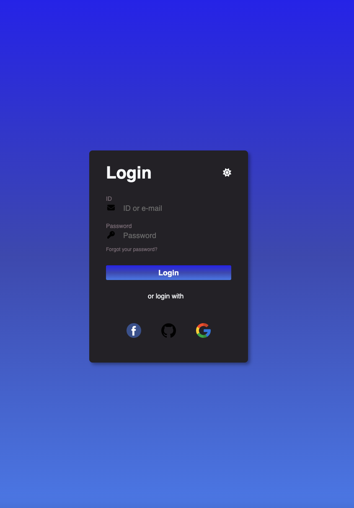

# Tela de Login / Login Screen

## Índice / Index

- <a href="#Sobre">Sobre o Projeto / About the Project</a>

- <a href="Funcionalidades">Funcionalidades / Functionalities

- <a href="Tecnologias">Tecnologias utilizadas / Used Technologies </a>

- <a href="imagens">Capturas de Tela / ScreenShot</a>

## Sobre o Projeto / About the Project

- Criação de um formulário de login.
O formulário tem campos de entrada simples como: ID e senha a.

- Creation of a simple login screen.
The form has simple input fields such as: ID and password.

## Funcionalidades / Functionalities

### • Modo escuro / Dark mode

- O formulário possui a função modo escuro. Caso o usuário deseje, pode clinar no icone no canto superior da tela para habilitar o modo escuro.

- The form has a dark mode function. If the user wishes, they can click on the icon in the top corner of the screen to enable dark mode.

## Tecnologias utilizadas / Used Technologies

- 

- 

- 

## Capturas de Tela / Screenshot

